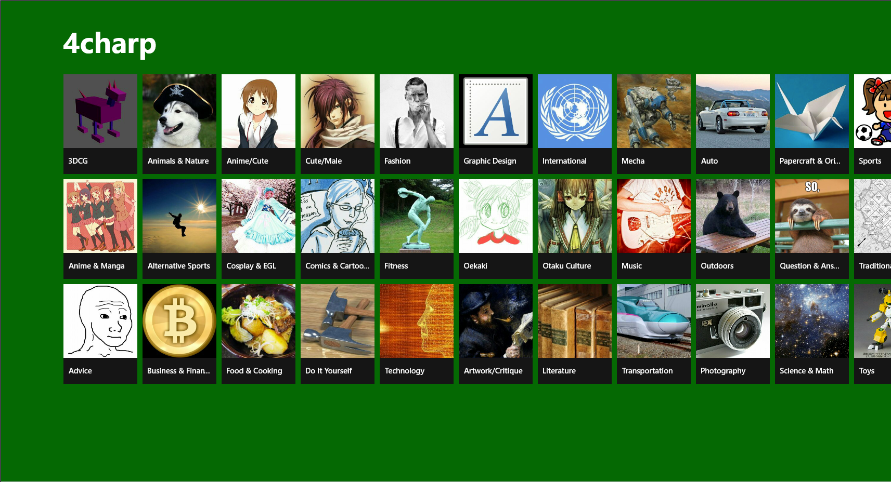
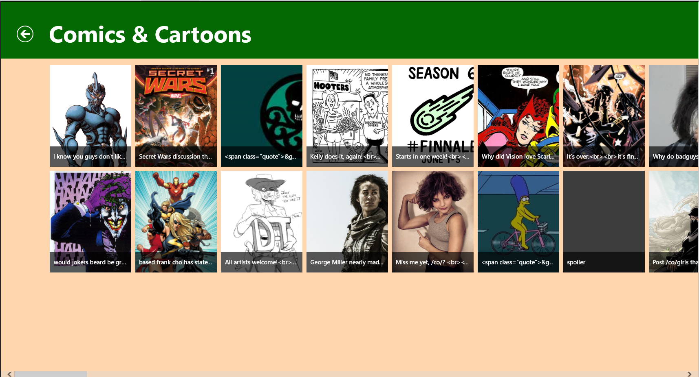

4charp
==

\newpage
Sommaire
--
* ###1. Présentation de l'équipe et du projet
* ###2. Fonctionnalités
* ###3. Documentation utilisateur
* ###4. Architecture du code
* ###5. Conclusion

\newpage
1. Présentation de l'équipe et du projet
--
Ce projet a été réalisé par :

* Yann GUINEAU
* Thomas SIFFERLEN
* Frédéric CAMPO

L'objectif de ce projet est de réaliser une application Windows Store qui fait appel a une API pour récupérer des données et les présenter a l'utilisateur final

2. Fonctionnalités
--
* Récupération des données de 4chan
* Remise en forme de ces données pour application Windows Phone
* Utilisation de l'API de 4chan

##3 - Documentation utilisateur
> ###A - Interface
>L'écran d'accueil
>
>
>
>
