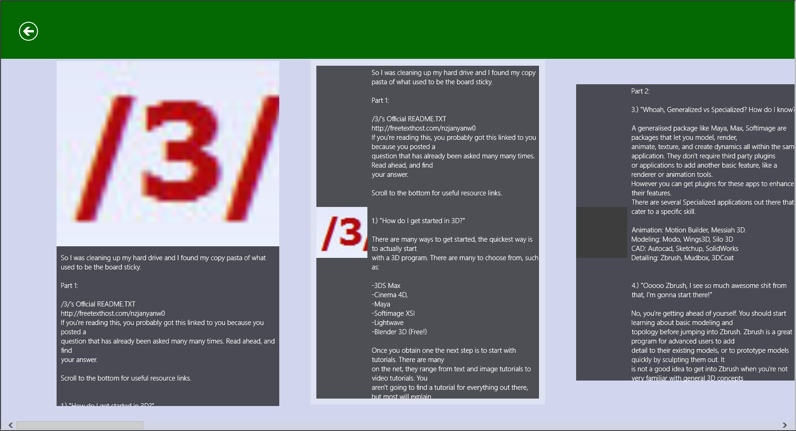

4charp
==
 

Utilisation de l'API de 4chan dans une application Windows Store.

Par Thomas SIFFERLEN, Yann GUINEAU et Frédéric CAMPO.

\newpage
Sommaire
--
* ###1. Présentation de l'équipe et du projet
* ###2. Fonctionnalités
* ###3. Documentation utilisateur
* ###4. Architecture du code
* ###5. Conclusion

\newpage
1. Présentation de l'équipe et du projet
--
Ce projet a été réalisé par :

* Yann GUINEAU
* Thomas SIFFERLEN
* Frédéric CAMPO

L'objectif de ce projet est de réaliser une application Windows Store qui fait appel a une API pour récupérer des données et les présenter à l'utilisateur final

2. Fonctionnalités
--
* Récupération des données de 4chan
* Remise en forme de ces données pour application Windows Phone
* Utilisation de l'API de 4chan

##3 - Documentation utilisateur
> ###A - Interface
>####L'écran d'accueil
>
>Une fois sur la page de l'accueil,  vous n'aurez qu'a appuyer sur la catégorie de votre choix afin de naviguer parmi tous les sujets proposés.
>####Menu des catégories
>
>
>####Un fil de discussion
>
>
> ### B - Les possibilités
> Vous n'avez aucune possibilité d'interagir avec les forums de 4chan, car l'application est avant tout une facilitation d'affichage pour les mobiles.

##4 - Architecture du code
###A - Contexte
4charp est une application multiplatforme
###B - Architecture
Windows Store nous contraint à une architecture MVVM, Modèle-Vue-VueModèle qui est adaptée pour le développement multiplateforme.

###C - Conception technique
Un espace de nom (_4chan) traite l'intégralité des données lié à l'API.
Chaque vue fait appel à une requête vers l'API de 4chan pour récupérer et traiter les données tel que la liste des forum, la liste des sujets et leurs messages.
Une fois le JSON parsé, les données sont stockées dans des containers pour être affichés par la vue en XAML. Chaque requête étant asynchrone, une barre de chargement permet à l'utilisateur de savoir que l'application n'est pas figée.

###D - Améliorations possibles

- Possibilité d'agir sur 4Chan a travers l'application (Creation de Tread/repondre/reporter un tread ...)
- Download precis ou groupé d'une ou plusieures images
- Changer le mode d'affichage des treads (en liste de une ou plusieurs lignes , en mosaique ...)
- Possiblité de masquer/afficher certains boards (dans une optique de censure des contenus sensibles)​

##5 - Conclusion
L'intégration d'une API dans une application Windows Store fut assez compliquée a mettre en oeuvre, demandant de fortes connaissances en C#. Néanmoins, ce projet, bien que de petite échelle, nous a permis de progresser tant sur un point de gestion d'équipe que sur la technique.
